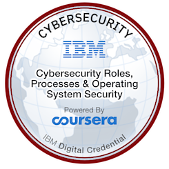

# Cybersecurity Roles, Processes & Operating System Security

This course gave an overview of:

* The different roles within a cybersecurity team
* IT processes and frameworks used in businesses, such as ITIL
* The CIA triad and AAA
* Windows and Linux file systems and commands
* Virtualisation and cloud computing

What particularly interested me here was learning more about how to use linux. I now know more about its commands, file structure and access control.

/

<figure><figcaption></figcaption></figure>

