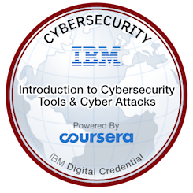

# Introduction to Cybersecurity Tools & Cyber Attacks

This course gave an overview of attacks, attackers, and tools used to defend against these attacks. What particularly interested me was learning about the range of cyber attacks, including:

* Packet sniffing
* IP spoofing
* DoS attacks
* Host insertions
* Malware
* Ransomware
* Cyberwarfare

...As well as the cyber kill chain.

Networking is a topic that caught my eye in particular and network defences were also something I particularly enjoyed learning about, including:

* Firewalls - stateful and stateless
* Packet filtering
* XML gateways

<figure><figcaption></figcaption></figure>

