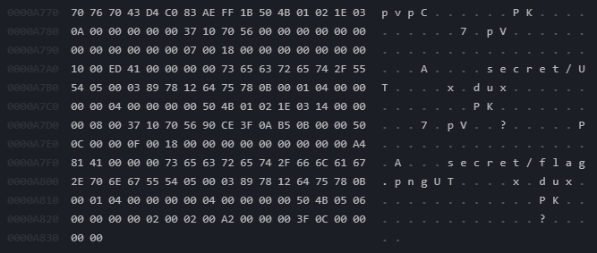

# picoCTF

This website contains sets of challenges from six domains of cybersecurity including general skills, cryptography, web exploitation, forensics, etc.&#x20;

<figure><figcaption></figcaption></figure>
