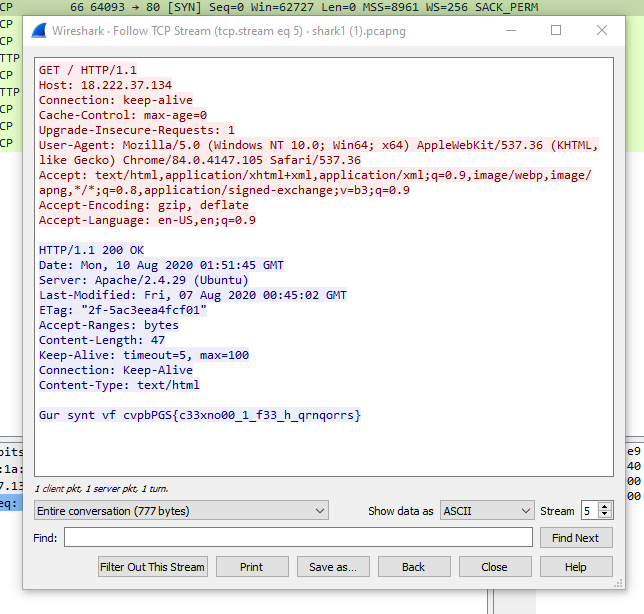

# Wireshark doo dooo do doo...

This CTF first gave a PCAP in which I decided to follow the TCP stream:

<figure><figcaption></figcaption></figure>

We can see there is a separate string of text at the bottom which looks encrypted.

<figure><figcaption></figcaption></figure>

I used an online tool which identified the type of encryption used which resulted in ROT13 being the most likely candidate. I then found an online ROT13 decoder which then decoded the text to give me the flag.
